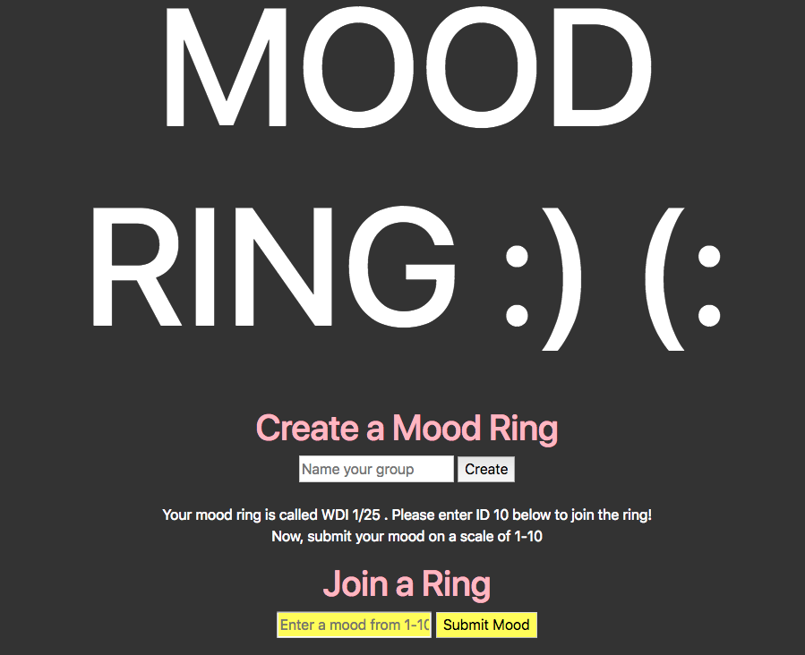

<b>mood-ring client</b>

_______

<b>mood-ring is an app that allows users to assess the average mood of a group of people.</b>

See the back end repository <a href="https://github.com/dbenbass/mood-ring"> here</a>.

Here are the links to the <a href="https://dbenbass.github.io/mood-ring-client"> deployed front end</a>, and the <a href="https://rocky-bastion-73525.herokuapp.com/"> deployed back end </a>

_______

