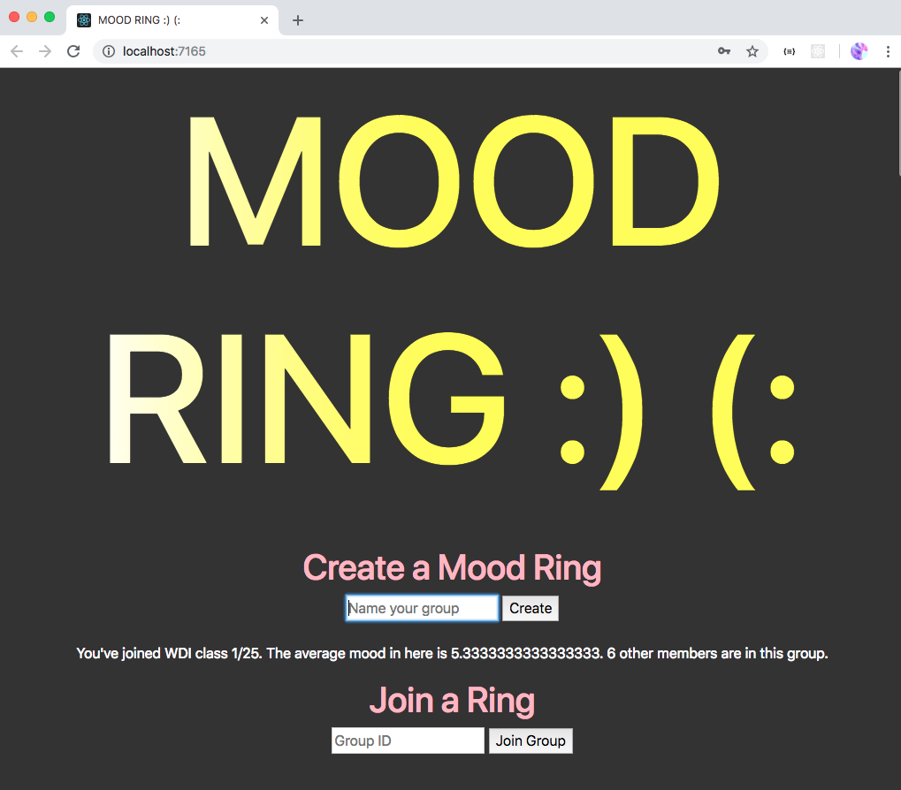

mood-ring client

_______

Front end of an app that allows users to assess the average mood of a group of people.

See the back end repository here -
https://github.com/dbenbass/mood-ring

Deployed front end -
https://dbenbass.github.io/mood-ring-client

Deployed back end -
https://rocky-bastion-73525.herokuapp.com/

_______

